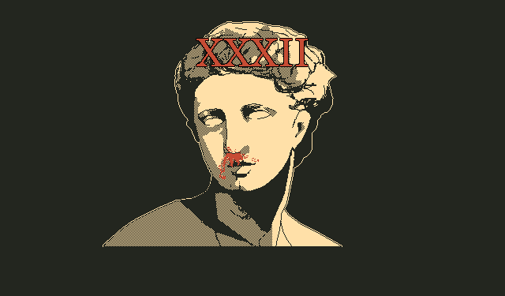

# XXXII



[](https://python.org)
[](https://github.com/clieg/xxxii/blob/master/LICENSE)
[](https://git-scm.com)
[](https://en.wikipedia.org/wiki/Spaghetti_code#Lasagna_code)


#### Screenshot


#### Requirements
* Python3 
* Python3 Tkinter


#### Downloading the Repository
If you have Git installed, you can run the command `git clone https://github.com/clieg/xxxii.git`. Otherwise, download the game's repo manually.


### Running
##### Unix-like
Before running the game, copy the Silver font to your `~/.fonts` directory, this is found at the `res/fonts/` directory. To do this, run the command `cp -v Silver.ttf`, if the `~/.fonts` does not exist, create one by running the command `mkdir ~/.fonts`.
To run the game, run the command `chmod +x run_xxxii.py` to make the game executable, then run the command `./run_xxxii.py` to execute the game.
Or just run the command `python3 run_xxxii.py`


##### Windows
If this does not work. Maybe try dual booting or setting up a VM with Linux.
*I haven't tested this game on Windows machine, but considering that Python is cross-platform, then there shouldn't be any problem.*


#### Windows
Before running the game, copy the Silver font, this is found at the `res/fonts/` directory. To do this simply double click the font and install it.
To run the game, run the command `python3 run_xxxii.py`.
*If this does not work. Maybe try dual booting, setting up a VM with Linux, or use WSL. I haven't tested this game on Windows machine, but considering that Python is cross-platform, then there shouldn't be any problem.*


### Usage
Running the command `./run_xxxii.py --h` or `python3 run_xxxii.py` will display the command line help option of the game:

```bash
usage: run_xxxii.py [-h] [-v] [-l] [-V]

optional arguments:
  -h, --help     show this help message and exit
  -v, --version  shows version
  -l, --license  shows license
  -V, --Verbose  shows verbose
```

### Documentation
Read the game's [documentation](https://github.com/clieg/xxxii/blob/master/DOC.md).


### License
This program is provided under the GPL-3.0 License. See [LICENSE](https://github.com/clieg/xxxii/blob/master/LICENSE) for more details.


### Author
[Clint E.](https://github.com/clieg)