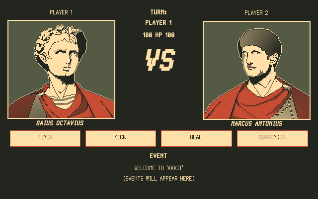

# XXXII


[](https://python.org)
[](https://github.com/clieg/xxxii/blob/master/LICENSE)
[](https://git-scm.com)
[](https://getfedora.org)
[](https://en.wikipedia.org/wiki/Spaghetti_code#Lasagna_code)


#### Screenshot


#### Requirements
* Python3
* Python3 Tkinter


### Running
##### Unix-like
Before running the game, copy the Silver font, this is found at the `res/fonts/Silver.ttf` directory. To do this, follow the instructions below:
```bash
# Download the repo
git clone https://github.com/clieg/xxxii.git

# Go the the repo's directory
cd xxxii

# Copy the font to the /.fonts directory
cp -v res/fonts/Silvert.ttf ~/.fonts

# If ~/.fonts directory does not exist
mkdir ~/.fonts

# Run the game
./run_xxxii.py

```


#### Windows
Before running the game, install the Silver font, this is found at the `res/fonts/Silver.ttf` directory. To do this simply double click the font and install it.

```shell
# Run the game
python3 run_xxxii.py
```
*If this does not work. Maybe try dual booting, setting up a VM with Linux, or use WSL. I haven't tested this game on Windows machine, but considering that Python is cross-platform, then there shouldn't be any problem.*


### Usage
Running the command `./run_xxxii.py --h` or `python3 run_xxxii.py` will display the command line help option of the game:

```bash
usage: run_xxxii.py [-h] [-a] [-v] [-l] [-V]

optional arguments:
  -h, --help     show this help message and exit
  -a, --author   show author
  -v, --version  show version
  -l, --license  show license
  -V, --Verbose  show verbose
```

### Documentation
Read the game's [documentation](https://github.com/clieg/xxxii/blob/master/DOC.md).


### License
Made by [Clint E](https://github.com/clieg). This program is provided under the [GPL-3.0 License](https://github.com/clieg/xxxii/blob/master/LICENSE).